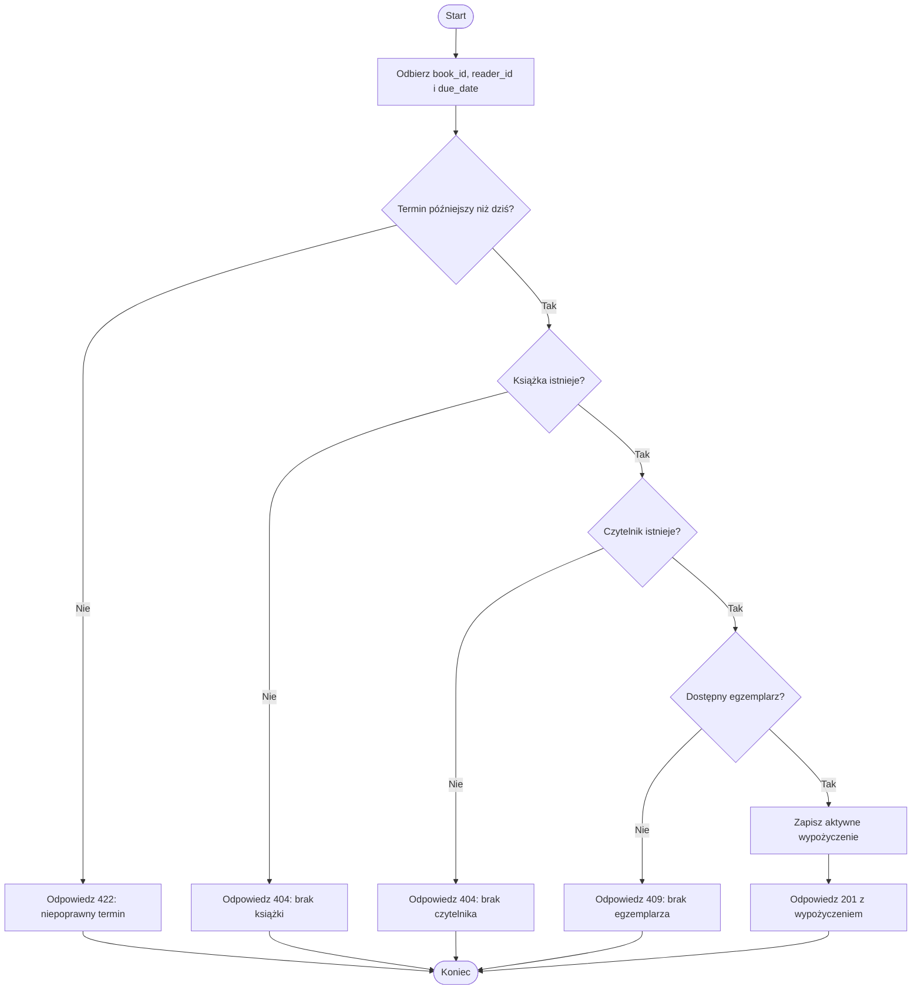
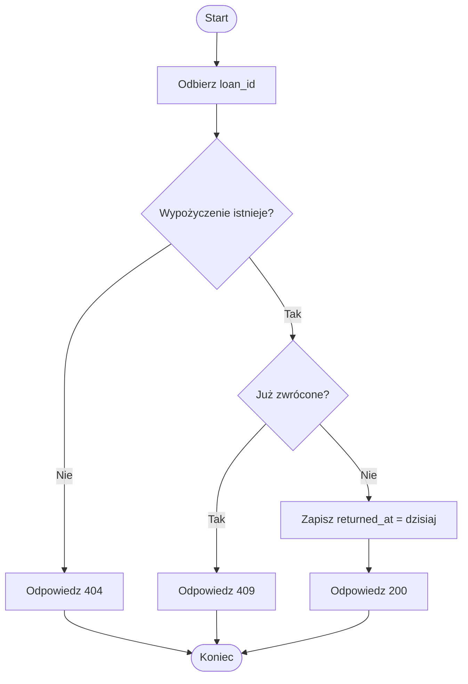

# Diagramy aktywności

## Wypożyczenie książki

```mermaid
flowchart TD
    A([Start]) --> B[Odbierz book_id, reader_id i due_date]
    B --> C{Termin późniejszy niż dziś?}
    C -- Nie --> X[Odpowiedz 422: niepoprawny termin]
    C -- Tak --> D{Książka istnieje?}
    D -- Nie --> Y[Odpowiedz 404: brak książki]
    D -- Tak --> E{Czytelnik istnieje?}
    E -- Nie --> Z[Odpowiedz 404: brak czytelnika]
    E -- Tak --> F{Dostępny egzemplarz?}
    F -- Nie --> W[Odpowiedz 409: brak egzemplarza]
    F -- Tak --> G[Zapisz aktywne wypożyczenie]
    G --> H[Odpowiedz 201 z wypożyczeniem]
    X --> I([Koniec])
    Y --> I
    Z --> I
    W --> I
    H --> I
```

## Zwrot książki

```mermaid
flowchart TD
    A([Start]) --> B[Odbierz loan_id]
    B --> C{Wypożyczenie istnieje?}
    C -- Nie --> D[Odpowiedz 404]
    C -- Tak --> E{Już zwrócone?}
    E -- Tak --> F[Odpowiedz 409]
    E -- Nie --> G[Zapisz returned_at = dzisiaj]
    G --> H[Odpowiedz 200]
    D --> I([Koniec])
    F --> I
    H --> I
```
