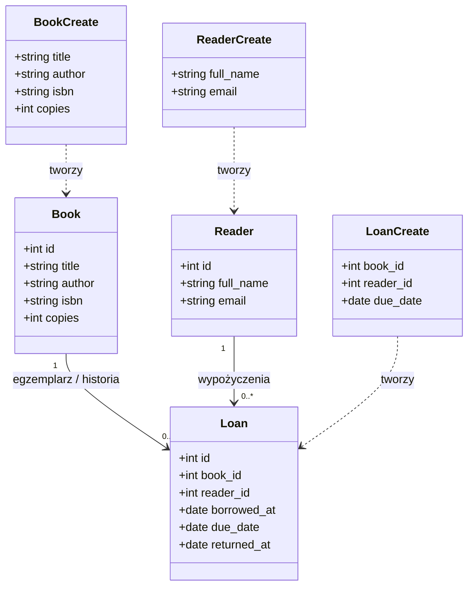

# Diagram klas

```mermaid
classDiagram
    class Book {
        +int id
        +string title
        +string author
        +string isbn
        +int copies
    }
    class Reader {
        +int id
        +string full_name
        +string email
    }
    class Loan {
        +int id
        +int book_id
        +int reader_id
        +date borrowed_at
        +date due_date
        +date returned_at
    }
    class BookCreate {
        +string title
        +string author
        +string isbn
        +int copies
    }
    class ReaderCreate {
        +string full_name
        +string email
    }
    class LoanCreate {
        +int book_id
        +int reader_id
        +date due_date
    }
    Book "1" --> "0..*" Loan : egzemplarz / historia
    Reader "1" --> "0..*" Loan : wypożyczenia
    BookCreate ..> Book : tworzy
    ReaderCreate ..> Reader : tworzy
    LoanCreate ..> Loan : tworzy
```
