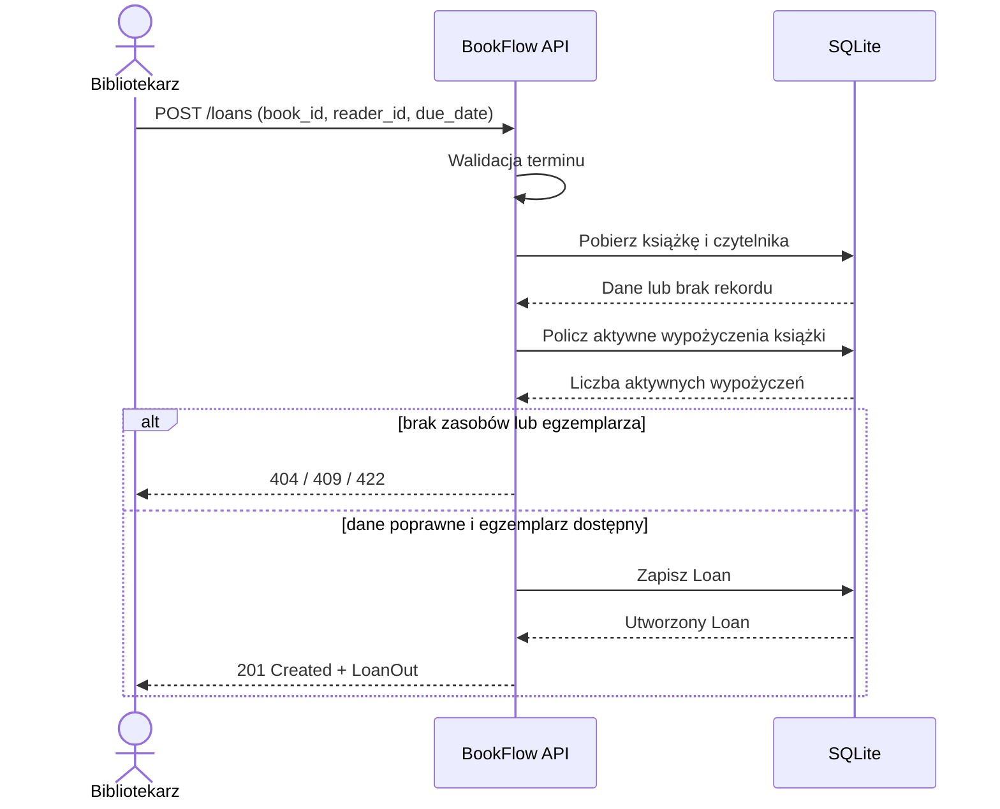
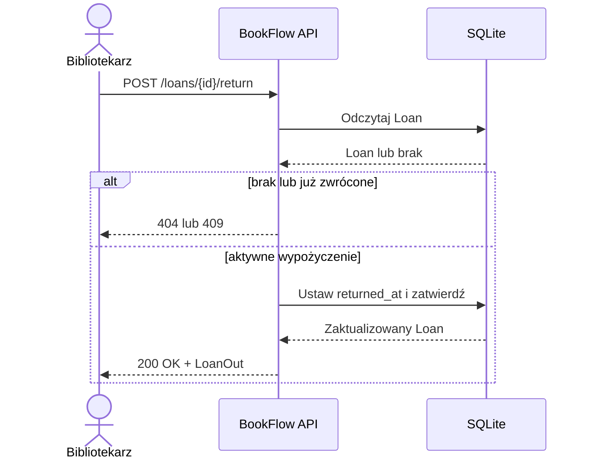

# Diagram sekwencji

## Wypożyczenie książki

```mermaid
sequenceDiagram
    actor B as Bibliotekarz
    participant API as BookFlow API
    participant DB as SQLite
    B->>API: POST /loans (book_id, reader_id, due_date)
    API->>API: Walidacja terminu
    API->>DB: Pobierz książkę i czytelnika
    DB-->>API: Dane lub brak rekordu
    API->>DB: Policz aktywne wypożyczenia książki
    DB-->>API: Liczba aktywnych wypożyczeń
    alt brak zasobów lub egzemplarza
        API-->>B: 404 / 409 / 422
    else dane poprawne i egzemplarz dostępny
        API->>DB: Zapisz Loan
        DB-->>API: Utworzony Loan
        API-->>B: 201 Created + LoanOut
    end
```

## Zwrot

```mermaid
sequenceDiagram
    actor B as Bibliotekarz
    participant API as BookFlow API
    participant DB as SQLite
    B->>API: POST /loans/{id}/return
    API->>DB: Odczytaj Loan
    DB-->>API: Loan lub brak
    alt brak lub już zwrócone
        API-->>B: 404 lub 409
    else aktywne wypożyczenie
        API->>DB: Ustaw returned_at i zatwierdź
        DB-->>API: Zaktualizowany Loan
        API-->>B: 200 OK + LoanOut
    end
```
