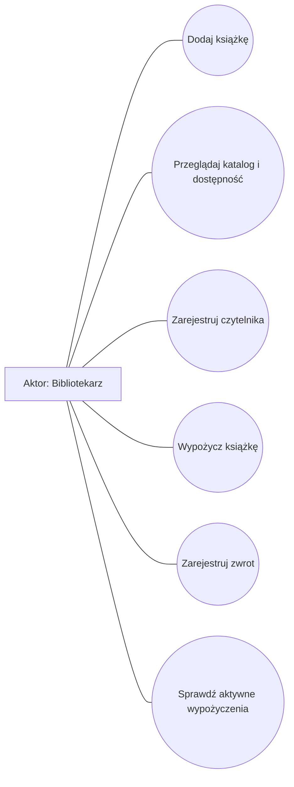

# Diagram przypadków użycia

```mermaid
flowchart LR
    librarian["Aktor: Bibliotekarz"]
    uc1(("Dodaj książkę"))
    uc2(("Przeglądaj katalog i dostępność"))
    uc3(("Zarejestruj czytelnika"))
    uc4(("Wypożycz książkę"))
    uc5(("Zarejestruj zwrot"))
    uc6(("Sprawdź aktywne wypożyczenia"))
    librarian --- uc1
    librarian --- uc2
    librarian --- uc3
    librarian --- uc4
    librarian --- uc5
    librarian --- uc6
```
